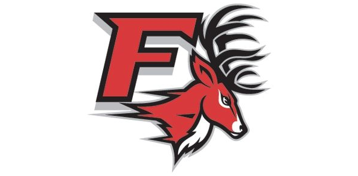

# Miscellanios-Projects-and-Utility
This is basically a compilation of some of the interesting things I acquired through my college career, building blocks for future projects. I thought this would be a good for those who are looking to start coding more seriously and act as almost as a shopping cart for those looking for pre made utility like classes.

